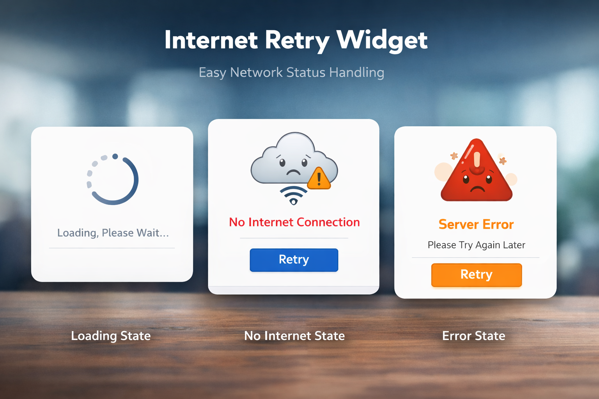

## Internet Retry Widget
[](https://kotlinlang.org/)
[](LICENSE)
[](#)

A lightweight, customizable, and lifecycle-aware Android library to handle **network states** like **No Internet, Loading, Error, and Content** with a clean UI.

---

### Features

*  Automatic internet detection (no manual checks)
*  Retry button with callback support
*  Loading state support
*  Error state handling
*  No Internet state UI
*  Content state handling
*  Fully customizable via XML
*  Easy to integrate (plug & play)

---

### Preview



---

## Installation

### Step 1: Add JitPack

```gradle
dependencyResolutionManagement {
    repositories {
        google()
        mavenCentral()
        maven { url 'https://jitpack.io' }
    }
}
```

### Step 2: Add Dependency

```gradle
dependencies {
	        implementation 'com.github.Excelsior-Technologies-Community:Android_AppPermissions:1.0.0'
	}
```

---

## Usage

### Add Widget in XML

```xml
<com.ext.internetretrywidget.InternetRetryWidget
    android:id="@+id/retryWidget"
    android:layout_width="match_parent"
    android:layout_height="match_parent"

    app:irw_message="No Internet Connection"
    app:irw_buttonText="Retry Now"
    app:irw_textColor="@android:color/holo_red_dark"
    app:irw_buttonColor="@android:color/holo_blue_dark"
    app:irw_icon="@android:drawable/ic_dialog_alert"/>
```

---

### Handle Retry Click

```kotlin
retryWidget.setOnRetryClick {
    // Retry your API call
}
```

---

### States Handling

You can control UI states programmatically:

```kotlin
retryWidget.setState(WidgetState.LOADING)

retryWidget.setState(WidgetState.NO_INTERNET)

retryWidget.setState(WidgetState.ERROR, "Server error occurred")

retryWidget.setState(WidgetState.CONTENT)
```

---

### Available States

| State         | Description              |
| ------------- | ------------------------ |
| `LOADING`     | Shows progress indicator |
| `NO_INTERNET` | Shows no internet UI     |
| `ERROR`       | Shows error message      |
| `CONTENT`     | Hides widget             |

---

### Custom Attributes

| Attribute         | Description         |
| ----------------- | ------------------- |
| `irw_message`     | Custom message text |
| `irw_buttonText`  | Retry button text   |
| `irw_textColor`   | Message text color  |
| `irw_buttonColor` | Button text color   |
| `irw_icon`        | Custom icon         |

---

### Permissions Required

```xml
<uses-permission android:name="android.permission.ACCESS_NETWORK_STATE"/>
```

---

### Example Use Case

```kotlin
retryWidget.setState(WidgetState.LOADING)

apiCall(
    onSuccess = {
        retryWidget.setState(WidgetState.CONTENT)
    },
    onError = {
        retryWidget.setState(WidgetState.ERROR, "Something went wrong")
    }
)
```

---

### License

```
MIT License

Copyright (c) 2025 Excelsior Technologies 

Permission is hereby granted, free of charge, to any person obtaining a copy
of this software and associated documentation files (the "Software"), to deal
in the Software without restriction, including without limitation the rights
to use, copy, modify, merge, publish, distribute, sublicense, and/or sell
copies of the Software, and to permit persons to whom the Software is
furnished to do so, subject to the following conditions:

The above copyright notice and this permission notice shall be included in all
copies or substantial portions of the Software.

THE SOFTWARE IS PROVIDED "AS IS", WITHOUT WARRANTY OF ANY KIND, EXPRESS OR
IMPLIED, INCLUDING BUT NOT LIMITED TO THE WARRANTIES OF MERCHANTABILITY,
FITNESS FOR A PARTICULAR PURPOSE AND NONINFRINGEMENT. IN NO EVENT SHALL THE
AUTHORS OR COPYRIGHT HOLDERS BE LIABLE FOR ANY CLAIM, DAMAGES OR OTHER
LIABILITY, WHETHER IN AN ACTION OF CONTRACT, TORT OR OTHERWISE, ARISING FROM,
OUT OF OR IN CONNECTION WITH THE SOFTWARE OR THE USE OR OTHER DEALINGS IN THE
SOFTWARE.
```
---
